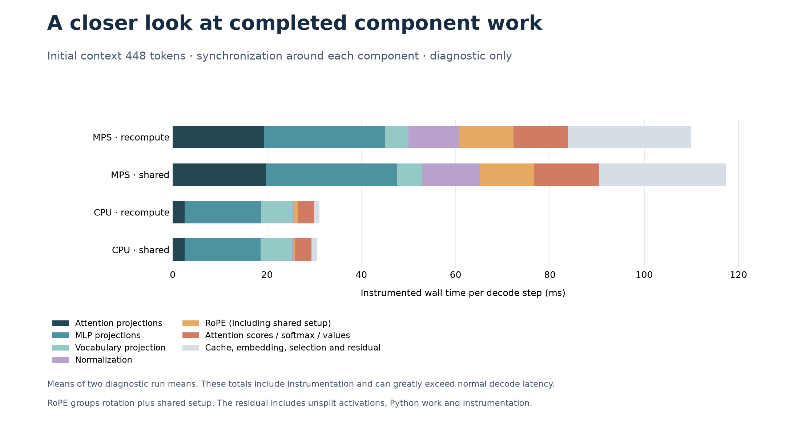

# Decode profiling: share RoPE setup across layers

Cached decoding still performs a complete decoder forward for each new token. This experiment measures how its cost changes with context length, inspects component and host overhead, and removes one repeated calculation: constructing rotary-position frequencies separately for every layer's queries and keys.

**What the profile can tell us**

The benchmark has three separate views. Normal decode timing measures the generation loop with synchronization only at its outer boundaries. Component diagnostics synchronize before and after each operation group, isolating completed work at the cost of disrupting execution. The PyTorch CPU profiler records host dispatch and waits; on MPS it does **not** measure Metal kernel execution.

That distinction matters. A long `aten::_local_scalar_dense` event in token validation can include waiting for the previous token's queued GPU work. Removing that event would not necessarily remove its entire measured duration. Likewise, synchronized linear-layer or normalization times include dispatch and synchronization overhead. The component totals describe the intrusive diagnostic run, not percentages of ordinary decode latency.

RoPE presented a bounded, testable change: the original forward constructed the same frequencies **48 times**—once for Q and once for K in each of Qwen's 24 layers. The profiler's sine/cosine call counts expose that repetition. Linear layers remain library operations; validation and causal attention are unchanged in this experiment.

**The optimization**

For positions `p` and even head dimension `D`, the split-half rotation uses:

```text
inverse_frequency[i] = theta ** (-2*i / D)
angle[p, i] = p * inverse_frequency[i]
rotated = concat(first*cos(angle) - second*sin(angle),
                 second*cos(angle) + first*sin(angle))
```

Every layer uses the same absolute positions, head dimension, dtype and `theta`. The new forward computes the cosine/sine tensors once, then shares them across all Q/K rotations. The rotations themselves still execute for each layer; only their common setup is shared. Setup calls fall from 48 to 1 per forward, not the whole model's work by that factor.

The tensors live for one forward call. They are not persistent buffers or a full-context lookup table, so moving the model, resetting a cache, or changing the append position cannot reuse stale values. This also leaves checkpoint keys and weight loading unchanged. The implementation supports both prefill chunks and single-token decode.

**The shared path is experimental and opt-in.** Pass `reuse_rope=True`, or CLI `--share-rope`, to use it. Recalculation remains the default because sharing regressed on MPS and CPU gains were modest. `--recompute-rope` explicitly selects that default. Last-token vocabulary projection is enabled in **both** variants of this experiment. The earlier projection benchmark explicitly disables RoPE sharing in both variants to preserve its original comparison.

**Measurement design**

Qwen2.5-0.5B, pinned checkpoint, float32, Apple M5 CPU/MPS, one CPU thread, one request at a time. Initial context lengths are **16, 64, 128, 256 and 448 tokens**, with **32 timed decode steps**. Prefill produces one untimed output token; normal whole-request comparisons generate 33 output tokens including that first token. Context grows during each trial rather than staying fixed at its starting length.

| View | Timing boundary and purpose |
| --- | --- |
| Normal decode | Prefill and cache allocation finish before the timer. Time 32 model calls, argmax operations and output appends; report total divided by 32. No extra per-step synchronization. |
| Whole request | Separate `generate` calls include fresh cache allocation, prefill and all 33 generated tokens. Loading, tokenization and initial prompt transfer are excluded. |
| Component diagnostics | Two separate runs per variant; synchronize around linear layers, normalization, RoPE, attention, cache writes, validation, embedding, and selection/append. Residual time includes unsplit activation/residual/view work, Python and instrumentation. |
| Host profiler | Separate first four decode steps with CPU activity only. Exclusive self times and overlapping inclusive times are saved with operator counts. No device utilization or bandwidth conclusions. |
| KV memory | Exact bytes in allocated and valid KV tensors; excludes weights, temporaries, allocator reservations and peak memory. |

Normal timings use five paired repeats after two warmups per variant. Execution order alternates within each pair and across contexts. CPU/MPS experiments run sequentially. EOS stopping is disabled. Each context uses one repeated, tokenized paragraph truncated to length; full token IDs, raw samples, source hashes and environment metadata are retained. These are controlled small samples, not a production prompt distribution, streaming inter-token latency, confidence intervals or tail latency.

**Results**

The change successfully removed repeated setup but **did not establish a portable speedup**. On CPU, median decode changes ranged from a 0.3% regression to a 4.3% improvement. At 16 initial tokens, decode fell from **30.17 to 28.86 ms/step**, with all five paired runs improving; whole-request time fell 2.8%. At other CPU lengths, changes were small and paired results sometimes disagreed.

On MPS, shared setup **regressed median decode latency at every tested context**, by 5.8–25.3%. At 16 initial tokens, decode rose from **25.68 to 32.15 ms/step** and whole-request time rose from **848.77 to 1052.81 ms**. All five paired decode/request runs at that length regressed. A [separate 16-token MPS rerun](../results/decode-rope-mps-confirmation.json) again regressed in all five decode/request pairs: median decode was 12.1% slower and requests 8.5% slower. The magnitude changed, so the initial 25% regression is not a fixed penalty. Therefore the measured candidate stays behind an explicit flag; it is not enabled automatically on CPU, MPS or untested CUDA hardware.

At 448 initial tokens on CPU, synchronized diagnostics attributed approximately **25.38 of 31.09 ms/step** to attention/MLP/vocabulary linear projections. RoPE rotation plus setup fell from **0.771 to 0.343 ms/step** when shared. This helps explain why cutting RoPE setup cannot produce a large CPU speedup: most measured work is elsewhere. On MPS the same intrusive baseline diagnostics totaled **109.90 ms/step**, compared with **28.62 ms/step** in normal timing—a concrete warning against treating synchronized component times as the ordinary critical path.

The host profiler confirms the operation-count change: over four decode steps, each of `aten::cos` and `aten::sin` falls from **192 calls to 4**; validation scalar reads remain **8**. The MPS regression's device-level cause is unresolved. Changes in dispatch, dependencies or command scheduling are hypotheses, not measured conclusions; resolving them requires a Metal device trace. No claims about GPU occupancy, bandwidth or utilization follow from these CPU events.

KV storage grows predictably: this model uses **24 KiB per cached token** (`2 × 24 layers × 2 KV heads × 64 dimensions × 4 bytes`). Allocated capacity grows from **1.148 to 11.273 MiB** across the sweep and is identical for both variants. CPU diagnostic attention cost grows with context in these runs; overall latency, especially on MPS, is not uniformly monotonic. The sweep does not isolate a hardware limit.

See the [complete measurements](decode-results.md) for both variants, paired changes, component tables, host operator counts and cache sizes. The matrices pass explicit `reuse_rope=False/True`; their source hashes record the measured version before the default was restored to recomputation. The default change does not alter either explicitly selected comparison path.




**Correctness and limits**

Each matrix case checks every prefill-final/decode vocabulary logit and all valid K/V cache entries against recomputation, with `atol=rtol=2e-4`. All timed and diagnostic runs must produce exactly the same token IDs. All **25 offline tests** pass. Unit tests exercise chunk boundaries, absolute offsets, cache reset, equal-length batches, CPU/MPS moves, cached/uncached generation and EOS. The full-checkpoint verifier independently compares layer/logit outputs and greedy tokens with Hugging Face Transformers on three prose/code fixtures: [CPU](../results/rope-cpu-verification.json), [MPS](../results/rope-mps-verification.json).

The largest request here reaches 481 returned tokens. Matrix correctness compares the new optimization to the existing engine at those lengths; independent full-checkpoint reference checks remain limited to the shorter fixtures. CUDA hardware, mixed precision, concurrent serving and contexts beyond this sweep remain unmeasured.

**Reproduce**

Run from the repository root, sequentially, after the checkpoint is cached:

```bash
uv run python -m unittest discover -s tests -v
uv run python benchmarks/verify_pretrained.py --share-rope --device mps --offline --output results/rope-mps-verification.json
uv run python benchmarks/verify_pretrained.py --share-rope --device cpu --offline --output results/rope-cpu-verification.json
uv run python benchmarks/decode.py --device mps --offline --output results/decode-rope-mps.json
uv run python benchmarks/decode.py --device cpu --offline --output results/decode-rope-cpu.json
uv run --no-project --python 3.12 docs/assets/render_decode.py
```

The renderer only reads saved measurements; it recreates figures and the detailed results table without rerunning inference. Reports remain `complete: false` until all requested cases pass.
