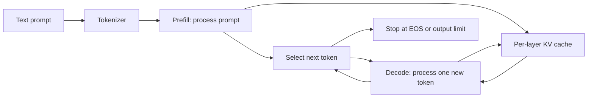
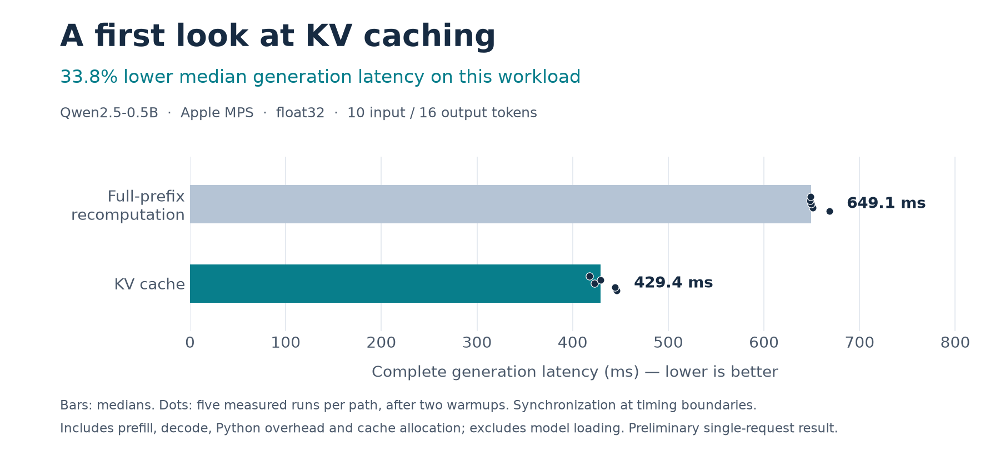
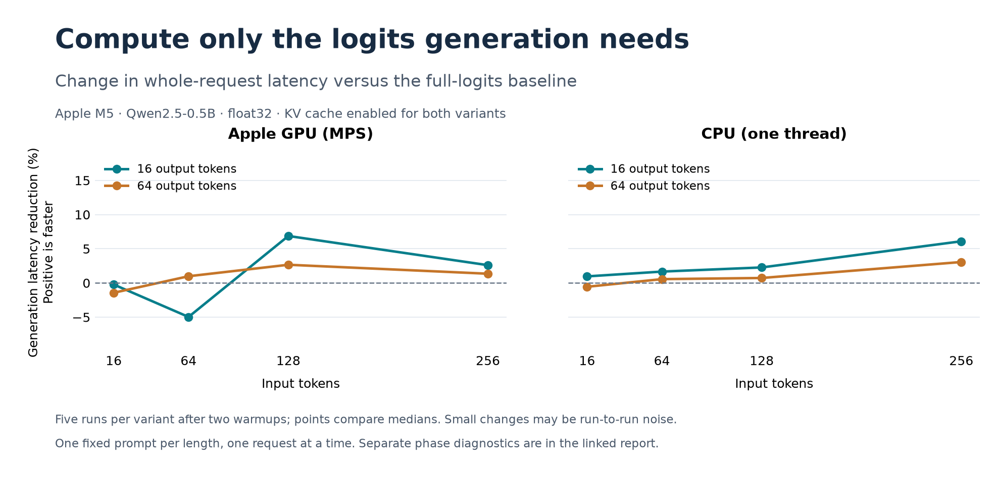
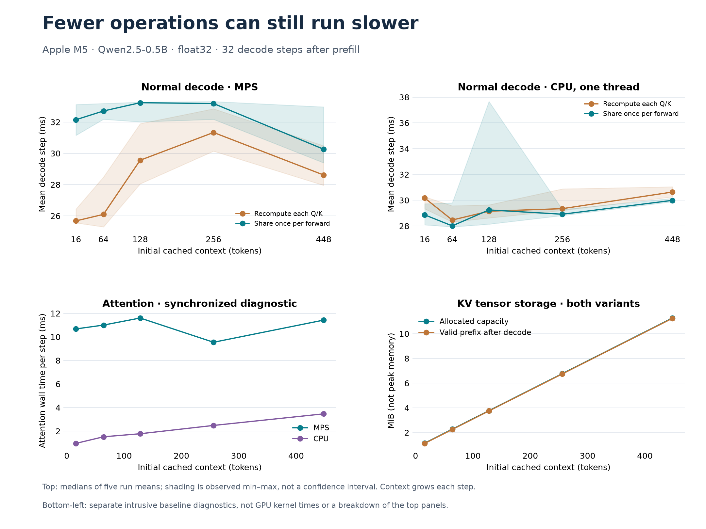

# LLM Inference Engine

*In progress · Python, PyTorch, Apple MPS · Updated September 15, 2026*

**Project overview**

A small LLM inference engine built to understand how model execution, memory management, and GPU performance fit together. It runs pretrained Qwen2.5-0.5B through a custom decoder and generation loop, with explicit weight loading, a reusable key/value (KV) cache, and numerical checks against Hugging Face Transformers.

Development currently targets CPU and the Apple GPU on a Mac. The longer-term goal is to replace selected PyTorch operations with CUDA C++ and Triton kernels, then study how kernel improvements affect whole-request performance and serving throughput. Those NVIDIA-specific optimizations are future work.

**What is implemented**

- A decoder with RMSNorm, rotary position embeddings, grouped-query attention, SwiGLU, and residual connections.
- Strict checkpoint loading, including tensor-name/shape checks and tied input/output embeddings. The model revision and dependencies are pinned.
- Prompt prefill, cached token-by-token decoding, greedy generation, EOS stopping, and explicit context limits.
- A preallocated contiguous KV cache with capacity checks, model ownership, reset/reuse, and position updates committed after successful forwards.
- CPU/MPS execution, reference checks, a workload matrix with separate prefill/decode diagnostics, and generation that projects only the final position into vocabulary logits.

The engine owns the forward pass, cache, and generation logic. PyTorch supplies tensor operations and matrix multiplication; Hugging Face supplies pretrained weights, tokenization, and the independent reference model. This project does not train the model or claim new model quality.

**How inference works**

Prefill processes the prompt and stores each layer's keys and values. Decode reuses that prefix and computes only the next token's contribution. The distinction matters: a one-token decode query still attends to the entire cached prefix. The causal mask therefore uses absolute token positions, not just the query tensor's local row number.

Portable PyTorch operations provide the baseline for future custom kernels. Generation handles one request; forward passes also support equal-length batches.

**Initial result: the effect of KV caching**

| Execution path | Median request time | Output tokens/s at median |
| --- | ---: | ---: |
| Recompute the full prefix each step | 649.1 ms | 24.6 |
| Reuse the KV cache | 429.4 ms | 37.3 |

Caching reduced median generation latency by **33.8%** on this workload. Both paths produced identical token IDs. This isolates the cache's effect within the same engine; it is not a comparison against a production inference framework.

**Measurement scope:** Qwen2.5-0.5B, Apple MPS, float32, one request with 10 input and 16 output tokens. Five timed runs per path followed two warmups, with alternating execution order and synchronized timing boundaries. Time includes prefill, decode, Python overhead, and cache allocation; model loading and initial prompt transfer are excluded. Output length was fixed with EOS stopping disabled. This short experiment does not establish serving throughput, tail latency, or NVIDIA performance. [Raw measurements and environment](../results/qwen-mps-generation-smoke.json)

**First optimization: discard work before computing it**

Generation used to compute vocabulary logits for every prompt position, then discard all but the last. The optimized path slices the final hidden state immediately before that projection. All prompt tokens still pass through the decoder and populate the KV cache; normal forward calls retain their full-logits interface.

The experiment covers 16/64/128/256 input tokens and 16/64 output tokens on CPU and MPS, with KV caching enabled for both variants. Each case uses five timed requests after two warmups. Separate diagnostic runs synchronize each phase, so their times are not streaming latency or a substitute for whole-request measurements.

For **256 input / 64 output tokens on Apple M5 MPS**, diagnostic prefill/first-token time fell from **113.1 to 83.4 ms (26.2%)**, while median whole-request time fell only **1.4%**. The returned prefill logits tensor shrank from 148.375 MiB to about 0.580 MiB; this is one tensor's storage, not peak memory saved.

The key lesson is that reducing prefill work does little to accelerate many subsequent decode steps. MPS whole-request results included small regressions and overlapping samples, so this is not a claim of a universal speedup. On CPU, the 256-input / 16-output case improved median request latency by 6.1%, with gains in all five paired runs. Exact generated token IDs matched the original path in all 16 CPU/MPS matrix cases. [Method and interpretation](performance-measurement.md) · [All CPU/MPS measurements](projection-results.md)

**Decode profiling: fewer operations can still be slower**

The next experiment sweeps 16–448 initial cached tokens and measures 32 decode steps on Apple M5 CPU/MPS, using Qwen2.5-0.5B float32. Normal decode and whole-request timing are separated from synchronized component diagnostics and CPU profiler events. Each variant receives two warmups and five paired timed runs; the workload remains one fixed prompt per shape.

RoPE rebuilt identical position frequencies for Q and K in all 24 layers. Sharing that setup once per forward reduced each sine/cosine operator from 192 to 4 calls over four profiled decode steps. All ten CPU/MPS cases preserved exact generated tokens and zero measured logit difference against recomputation.

At 16 initial tokens, CPU mean decode-step latency improved **4.3%**, with gains in all five paired runs; whole-request latency improved **2.8%**. CPU gains elsewhere were small or absent. MPS decode instead became **5.8–25.3% slower** across the sweep. The shared path therefore remains **experimental and opt-in**, with the existing default preserved.

This result changed the implementation decision: fewer tensor operations do not guarantee a faster asynchronous GPU workload. Host waits can include earlier queued work, and synchronized diagnostic totals cannot substitute for normal latency. The MPS device-level cause remains unresolved. Exact KV storage grew linearly at 24 KiB/token and was unchanged by sharing. [Method and interpretation](decode-performance.md) · [All measurements and profiler counts](decode-results.md)

**Correctness before optimization**

Twenty-five offline tests cover operation references, weight mapping, causal masking, cached versus full computation, chunked prefill, cache reuse and overflow, failed-forward handling, generation behavior, optimized-projection parity, shared-RoPE parity, and measurement accounting.

Separate full-checkpoint checks with shared RoPE enabled passed on CPU and MPS for three short prose/code prompts. They compare embedding and layer outputs, prefill logits, and cached decode logits. Cached and uncached greedy generation both exactly matched the reference token sequences on those fixtures. [CPU verification](../results/rope-cpu-verification.json) · [MPS verification](../results/rope-mps-verification.json)

Changing devices or prefill chunk sizes also changed Hugging Face's float32 results slightly. Matching devices and shapes helped distinguish implementation errors from backend numerical drift; the reports retain explicit tolerances and exact greedy-token checks. [Numerical methodology](pretrained.md)

**Engineering decisions and current boundaries**

The first cache uses contiguous storage to make ownership, capacity, and token positions easy to inspect. Model construction on the meta device avoids allocating an unnecessary set of random weights before loading a checkpoint. Raw measurements include source hashes, dependency versions, and model revision so later comparisons can identify the code that produced them.

The current implementation favors inspectable computation: it materializes attention scores, repeats KV heads for grouped-query attention, and performs some host-side validation. Component diagnostics identify costly operation groups; they do not establish a GPU hardware bottleneck. Pretrained generation defaults to a 512-token local context cap. The decode sweep reaches 448 input plus 33 output tokens; broader prompts and longer contexts remain to be validated.

**Next milestones**

Add bounded request scheduling and continuous batching. Investigate the RoPE regression with a Metal device trace when available. Once NVIDIA hardware is available, validate the CUDA baseline, implement selected CUDA/Triton kernels, and connect profiler evidence to end-to-end results.

**Explore the implementation**

[Architecture and code walkthrough](engine-walkthrough.md) · [Checkpoint loading and validation](pretrained.md) · [Project roadmap](project-plan.md) · [Source repository](https://github.com/gpack2/inference-engine)

Figures are derived from saved measurements. [KV-cache SVG](assets/kv-cache-baseline.svg) · [Projection SVG](assets/last-token-projection.svg) · [Decode SVG](assets/decode-context-sweep.svg) · [Component SVG](assets/decode-components.svg). Reproduce them with the scripts in `docs/assets/`; rendering uses an isolated environment and leaves engine dependencies unchanged.
